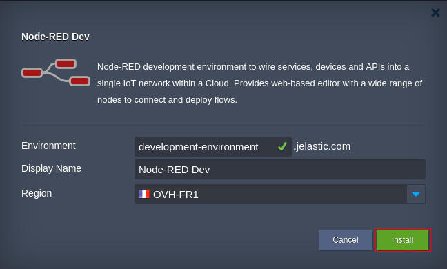
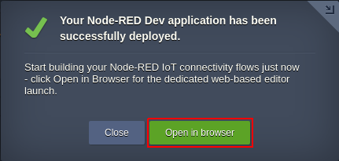

 
# Node-RED Development Environment  
 
Prepackaged [Node-RED](https://nodered.org/) IoT programming tool for connecting online services, hardware devices and APIs through an interactive browser-based editor.
 
## One-Click Node-RED Package Specifics
 
Providing ready-to-go Node-RED development environment, the current solution has the following implementation specifics:
 
- based on [nodered/node-red-docker](https://hub.docker.com/r/nodered/node-red-docker/) Docker image with the _latest_ tag as a solution base
- created Node-RED instance is assigned *16 dynamic cloudlets*, which enable it to [scale out](https://docs.jelastic.com/automatic-vertical-scaling) up to 2 GiB of RAM and 6.4 GHz of CPU
- automatically attached [endpoint](https://docs.jelastic.com/endpoints) allows to access your Node-RED admin panel through a randomly allocated [Shared Load Balancer](https://docs.jelastic.com/shared-load-balancer) port, eliminating the necessity to purchase Public IP address
 
## How to Install Node-RED Development Environment
 
In order to get Node-RED Development Environment instantly deployed, click the **Deploy to Jelastic** button below and specify your email address within the opened widget. Then choose one of the [Jelastic Public Cloud](https://jelastic.cloud) providers (in case you don’t have an account at the chosen platform, it will be created automatically) and click **Install**.
 

 
To deploy the package manually, log in to Jelastic dashboard with your credentials and [import](https://docs.jelastic.com/environment-import) link to the **_manifest.jps_** file above.
 

In the opened installation dialog box, type a name and, optionally, *Display Name* ([alias](https://docs.jelastic.com/environment-aliases))  for your *Environment*, select a _[Region](https://docs.jelastic.com/environment-regions)_ it will be placed at (if several ones are available) and click **Install**.

When deployment is completed, you’ll see the appropriate confirmation pop-up with the **Open in browser** option to launch Node-RED development dashboard. 
 

